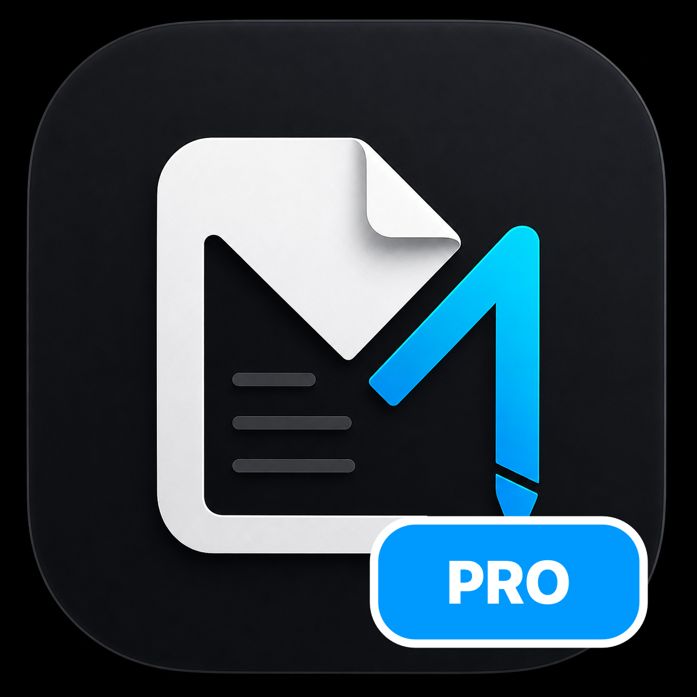
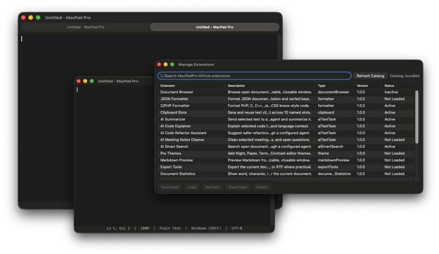

<p align="center">
  
</p>

<h1 align="center">MacPad Pro</h1>

<p align="center">
  Extension-friendly macOS plain-text editor with downloadable Pro extensions.
  MacPad Pro on [MacPad Pro on DeepWiki](https://deepwiki.com/anvilfilbert/MacPadPro)
</p>

<p align="center">
  
</p>

MacPad Pro is the extension-friendly edition of [MacPad](https://github.com/anvilfilbert/MacPad). MacPad stays small and Notepad-like. MacPad Pro is where optional themes, tools, formatters, panels, and AI-agent workflows can grow without changing the simple app.

## Features

- Plain-text editing with tabs, windows, find/replace, zoom, word wrap, status bar, and file save/open support.
- Language recognition in the status bar for common code and markup files.
- Syntax coloring for PHP and C-family files, including comments, strings, keywords, numbers, PHP variables, and PHP open tags.
- Built-in text commands: trim trailing whitespace, sort lines, uppercase, and lowercase.
- Extension Manager for downloading, loading, activating, deactivating, and deleting Pro extensions one by one.
- Script text-command plugins with manifest-declared permissions and SHA-256 verified package files.
- Data-driven package resources with SHA-256 verification for extension-owned files such as theme definitions.
- Local-first extension behavior for clipboard, snippets, backups, versions, and document tools.
- Optional AI extensions that connect only to user-configured local or remote OpenAI-compatible agents.

## Downloadable Extensions

Fresh installs do not activate downloadable extensions. Users enable only the extensions they want from `Extensions > Manage Extensions...`.

| Extension | ID | Menu | Notes |
| --- | --- | --- | --- |
| Document Browser | `open-documents` | `Extensions > Document Browser` | Detached, resizable, closable open-document browser. |
| Pro Themes | `pro-themes` | `Extensions > Themes` | Night, Paper, Terminal, Ocean, Forest, Sunset, Lavender, High Contrast. |
| Clipboard Slots | `clipboard-slots` | `Extensions > Clipboard Slots` | Save and reuse clipboard content across 10 slots. |
| Markdown Preview | `markdown-preview` | `Extensions > Markdown > Preview` | Detached live Markdown preview from selection or document. |
| Export Tools | `export-tools` | `Extensions > Export > Export As...` | Export as PDF, HTML, Markdown, or RTF. |
| Document Statistics | `document-statistics` | `Extensions > Tools > Document Statistics` | Word, character, line, selection, and reading-time report. |
| Diff Viewer | `diff-viewer` | `Extensions > Tools > Compare...` | Compare against clipboard text or another file. |
| Auto Backup / Versions | `auto-backup` | `Extensions > Backup > Version History` | Local timestamped snapshots with restore/copy controls. |
| Clipboard & Snippets Manager | `clipboard-snippets` | `Extensions > Clipboard & Snippets` | Detached panel for recent clipboard text and pinned named snippets. |
| File Outline | `file-outline` | `Extensions > Navigation > File Outline` | Markdown headings and simple code symbols with line navigation. |
| CSV Table Viewer | `csv-table-viewer` | `Extensions > Data > Table Preview` | CSV/TSV preview without changing source text. |
| Markdown Tools | `markdown-tools` | `Extensions > Markdown > Tools` | Checkbox, table, list formatting, ordered-list renumbering. |
| Encoding / Line Ending Tools | `encoding-line-endings` | `Extensions > Text > Encoding & Line Endings` | Show UTF-8 status and convert Unix, Windows, classic Mac line endings. |
| Focus / Typewriter Mode | `focus-mode` | `Extensions > View > Focus Mode` | Distraction-free editing toggle. |
| JSON Formatter | `json-formatter` | `Extensions > Format As` | Pretty-print JSON. |
| C/PHP Formatter | `c-family-formatter` | `Extensions > Format As` | Format PHP, C, C++, Java, JavaScript, TypeScript, and CSS brace-style code. |
| Title Case Command | `title-case-command` | text commands | Example JavaScript plugin command with checksum-verified package script. |
| AI Summarizer | `ai-summarizer` | `Extensions > AI > Summarize Selection` | Sends selected text to configured agent. |
| AI Code Explainer | `ai-code-explainer` | `Extensions > AI > Explain Code` | Explains selected code with filename/language context. |
| AI Code Refactor Assistant | `ai-code-refactor` | `Extensions > AI > Suggest Refactor` | Opens suggested refactor output in a new document. |
| AI Meeting Notes Cleaner | `ai-meeting-notes` | `Extensions > AI > Clean Meeting Notes` | Produces summary, decisions, action items, open questions. |
| AI Smart Search | `ai-smart-search` | `Extensions > AI > Smart Search` | Detached semantic search over open document snippets. |

## Extension Catalog

MacPad Pro publishes its downloadable extension catalog from this repository:

```text
RepositoryExtensions/catalog.json
```

The app reads the raw GitHub catalog URL:

```text
https://raw.githubusercontent.com/anvilfilbert/MacPadPro/main/RepositoryExtensions/catalog.json
```

Each extension has:

- source code under `Sources/NotepadMacCore/Extensions/<extension-id>/`
- package manifest under `RepositoryExtensions/<extension-id>/<extension-id>.macpadproext`
- catalog entry in `RepositoryExtensions/catalog.json`
- runtime registration through `ExtensionCatalog.default`
- public-release verification through `./scripts/verify-public-repo.sh`

Downloaded `.macpadproext` packages are stored locally in Application Support under `MacPad Pro/Extensions`. Packages are decoded and validated against the selected catalog entry before loading.

Packages can include extra files such as `transform.js` or `themes.json`. MacPad Pro downloads those files separately, verifies SHA-256 checksums, and loads active package resources only after validation. Pro Themes keeps its color definitions in `RepositoryExtensions/pro-themes/themes.json` so contributors can change themes in the extension package area.

Package manifests can declare `packageFormatVersion` and `minimumMacPadProVersion`; incompatible packages are rejected before loading.

## AI Agent Setup

AI extensions require a user-configured local or remote OpenAI-compatible agent. MacPad Pro does not ship with built-in AI credentials. AI calls are explicit user actions and do not run in the background.

`Extensions > AI Agent Settings...` includes provider presets:

- Local Ollama: free local models, no API token
- OpenRouter Free Models: hosted free-model catalog, OpenRouter token required
- Groq Free Tier: hosted free-tier inference, Groq token required
- Google Gemini Free Tier: Gemini API free tier, Google AI Studio token required
- OpenAI: OpenAI API, OpenAI API token required

Public hosted AI endpoints normally require tokens even for free tiers. The no-token option is local Ollama.

## Documentation

- [Plugin Author How-To](docs/Plugin-Author-Howto.md)
- [Creating MacPad Pro Extensions](docs/Creating-Extensions.md)
- [Repository Extension Catalog](RepositoryExtensions/README.md)
- [Contributing](CONTRIBUTING.md)
- [Security](SECURITY.md)
- [Changelog](CHANGELOG.md)

## Build

```sh
./scripts/build-app.sh
```

The app bundle is created at:

```text
build/MacPad Pro.app
```

Install it into `/Applications` with:

```sh
./scripts/install-app.sh
```

Create a release zip with:

```sh
./scripts/package-release.sh
```

Verify the release path with public-repository checks, packaging, and code-signature checks:

```sh
./scripts/verify-release.sh
```

Release packaging writes:

```text
dist/MacPadPro-<version>-macOS-universal.zip
dist/MacPadPro-<version>-macOS-universal.zip.sha256
```

## Development

Run public repository checks:

```sh
./scripts/verify-public-repo.sh
```

Before pushing extension changes, verify:

- `./scripts/verify-release.sh`
- `./scripts/install-app.sh` when the local `/Applications` build should be refreshed

The GitHub Actions workflow template lives at `docs/GitHub-Actions-CI.yml`. To activate CI, copy it to `.github/workflows/ci.yml` using GitHub credentials with `workflow` scope.
